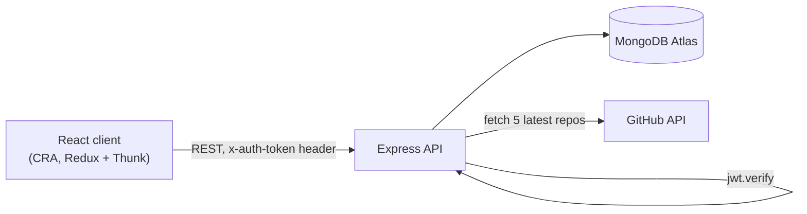

# DevConnector


[](https://devconnector-coc3.onrender.com)

A social network for developers. Users register, build a profile (bio, skills, experience and education timeline, GitHub username), and post to a public feed with likes and threaded comments. A profile page can also pull in that user's five most recent GitHub repositories. Client and API live in one repo (`client/`, root) behind a JWT-secured REST API.

> [!NOTE]
> Built April–May 2021 by following Brad Traversy's ["MERN Stack Front To Back"](https://www.udemy.com/course/mern-stack-front-to-back/) course. Redux here is the pre-Redux-Toolkit pattern (actions/reducers + thunk) the course used at the time. The course targeted Heroku, which has since removed its free tier — this repo now runs on Render instead.

---

## Architecture



In production, the Express server also serves the built React app as static files ([server.js](server.js)) instead of running a separate frontend host — a single-process deployment matching the course's Heroku target, and the reason the current Render setup is one web service rather than two.

## API

All routes below are prefixed with `/api`. Routes marked 🔒 require a valid `x-auth-token`.

| Resource | Route | What it does |
|---|---|---|
| Users | `POST /users` | Register a new user, hash password, return a JWT |
| Auth | `POST /auth` | Log in, return a JWT |
| Auth | `GET /auth` 🔒 | Return the logged-in user (used to keep sessions alive on refresh) |
| Profile | `GET /profile/me` 🔒 | Get the current user's own profile |
| Profile | `POST /profile` 🔒 | Create or update the current user's profile |
| Profile | `GET /profile` | List all profiles |
| Profile | `GET /profile/user/:user_id` | Get one user's profile |
| Profile | `DELETE /profile` 🔒 | Delete the current user's profile, user, and posts |
| Profile | `PUT /profile/experience` 🔒 | Add a work experience entry |
| Profile | `DELETE /profile/experience/:exp_id` 🔒 | Remove a work experience entry |
| Profile | `PUT /profile/education` 🔒 | Add an education entry |
| Profile | `DELETE /profile/education/:edu_id` 🔒 | Remove an education entry |
| Profile | `GET /profile/github/:username` | Proxy to GitHub's API for that user's latest repos |
| Posts | `POST /posts` 🔒 | Create a post |
| Posts | `GET /posts` 🔒 | List all posts |
| Posts | `GET /posts/:id` 🔒 | Get one post |
| Posts | `DELETE /posts/:id` 🔒 | Delete a post (only its owner) |
| Posts | `PUT /posts/like/:id` 🔒 | Like a post |
| Posts | `PUT /posts/unlike/:id` 🔒 | Remove a like |
| Posts | `POST /posts/comment/:id` 🔒 | Add a comment |
| Posts | `DELETE /posts/comment/:id/:comment_id` 🔒 | Remove a comment (only its owner) |

---

## Key decisions

- **Stateless JWT auth via a custom header, not `Authorization: Bearer`** ([middleware/auth.js](middleware/auth.js)) — the client sends the token as `x-auth-token`; the middleware calls `jwt.verify` against a shared secret and attaches `req.user` before handing off to the route. Simple to reason about, at the cost of not following the more common bearer-token convention.
- **Passwords hashed with bcryptjs before save** ([routes/api/users.js](routes/api/users.js)) — standard salted hashing on registration, never storing plaintext.
- **Gravatar for avatars, no upload feature** ([routes/api/users.js](routes/api/users.js)) — avatars are derived from the user's email hash via Gravatar's API instead of building image upload/storage. Removes a whole feature surface (storage, file validation) at the cost of users needing a Gravatar account for a custom photo.
- **Likes and comments embedded on the Post document, not separate collections** ([models/Post.js](models/Post.js)) — a post's likes and comments live as subdocuments on `Post` rather than their own Mongo collections. Fetching a post gets its comments for free in one query; the trade-off is the whole post (comments included) is rewritten on every like/comment.
- **Validation centralized with `express-validator`** — each route declares its own validation chain (required fields, email format, password length, etc.) and returns 400s with field-level messages before touching the database, instead of validating ad hoc inside handlers.
- **Classic Redux (actions + reducers + thunk), not Redux Toolkit** ([client/src/actions](client/src/actions), [client/src/reducers](client/src/reducers)) — reflects the version of the course taken; state updates go through hand-written action creators and switch-style reducers rather than `createSlice`.

---

## What this taught me

- Wiring authentication end to end: issuing a JWT on register/login, verifying it in middleware, and using the decoded `req.user.id` to scope every profile/post query to whoever is logged in.
- Modeling data in MongoDB isn't just "dump JSON" — embedding likes/comments on `Post` versus referencing them is a real trade-off between query count and document size, and I had to pick one deliberately (see [Key decisions](#key-decisions)).
- Keeping a third-party API key server-side: the GitHub token never reaches the client bundle, the API proxies the request instead.
- That "prepared for deployment" doesn't age well — this was built for Heroku's free tier, which no longer exists. Moving it to Render years later meant the config setup had to become host-agnostic (env vars via the `config` package's `custom-environment-variables.json`) instead of assuming one platform's conventions.

---

## Stack

| Layer | Technology | Role in this project |
|---|---|---|
| Frontend | React 17, React Router 5 | CRA app, client-side routing |
| Frontend state | Redux + Redux Thunk | Global state (auth, profile, posts, alerts) |
| HTTP | Axios | API calls from the client |
| Backend | Express | REST API (`/api/users`, `/api/auth`, `/api/profile`, `/api/posts`) |
| Auth | jsonwebtoken, bcryptjs | Token issuing/verification, password hashing |
| Validation | express-validator | Request validation per route |
| Database | MongoDB (Mongoose) | Users, profiles, posts |
| Config | `config` package | `config/default.json` locally (gitignored), environment variables in production |

---

## Run locally

Requires a MongoDB connection string (e.g. a free MongoDB Atlas cluster) and a JWT secret of your choice.

```bash
npm install               # root/server dependencies
npm install --prefix client
npm run dev                # runs server (port 5000) and client (port 3000) together
```

<details>
<summary>Environment variables</summary>

The server reads config via the `config` package from `config/default.json`, which is gitignored and not committed. Create it yourself:

```json
{
  "mongoURI": "<your MongoDB connection string>",
  "jwtSecret": "<any random string>",
  "githubToken": "<a GitHub personal access token, optional>"
}
```

| Key | Purpose |
|---|---|
| `mongoURI` | MongoDB connection string |
| `jwtSecret` | Secret used to sign/verify JWTs |
| `githubToken` | Used by `GET /api/profile/github/:username` to fetch a user's latest repos without hitting GitHub's anonymous rate limit — the rest of the app works without it |

In production (Render), the same three keys are read from environment variables (`MONGO_URI`, `JWT_SECRET`, `GITHUB_TOKEN`) via `config/custom-environment-variables.json` — see [render.yaml](render.yaml).

No `config/default.json.example` is committed — TODO for me to add one.

</details>

---

## Project structure

```
.
├── routes/api/        # Express routes: users, auth, profile, posts
├── models/            # Mongoose schemas: User, Profile, Post
├── middleware/         # JWT auth middleware
├── config/            # DB connection, env var mapping, (gitignored) default.json
├── server.js           # Express entry point, serves client/build in production
└── client/
    └── src/
        ├── actions/     # Redux action creators
        ├── reducers/    # Redux reducers
        └── components/  # auth, dashboard, profile(-form), post(s), layout, routing
```

## Tests and status

There are no automated tests (`client`'s `react-scripts test` is present from Create React App but unused). The GitHub-repos widget on profile pages needs its own `githubToken` to work — the rest of the app doesn't.

## License

No license file is included. This is a personal learning project — shown here for portfolio purposes.
